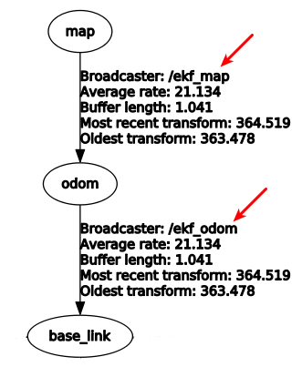
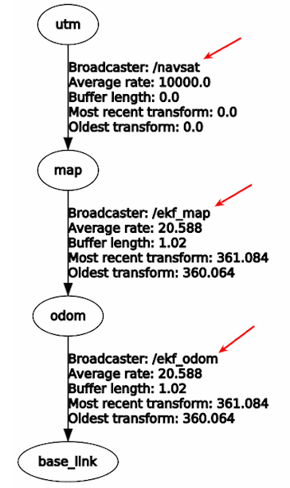

# ros_my_localization

The [ekf_localization_node](http://docs.ros.org/melodic/api/robot_localization/html/state_estimation_nodes.html) fuses topics (imu, pose, odometry) and publish corresponding tf. But the [gmapping](http://wiki.ros.org/gmapping) can only publish tf `/map` &rarr; `/odom`, and the [rf2o_laser_odometry](http://wiki.ros.org/rf2o) can only publish odometry `odom` &rarr; `base_link`. It doesn't help for ekf_localization_node to create tf `/map` &rarr; `/odom`.

---

## map -> odom -> base_link

---

## utm -> map -> odom -> base_link

